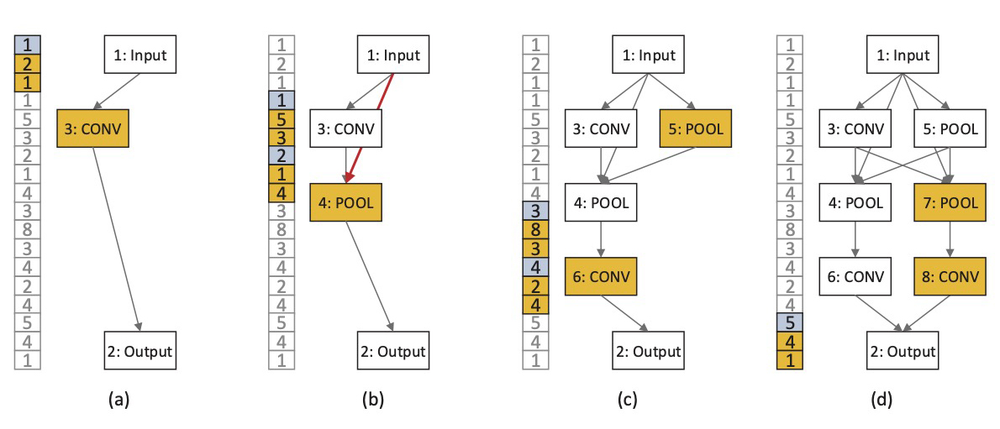

# ACEncoding
Code accompanying the paper 
>*Action Command Encoding for Surrogate Assisted Neural Architecture Search*

ACEncoding is an encoding strategy of NAS. The proposed ACEncoding is inspired by the process of gene expression, where each architecture is constructed by a series of action commands and each action command is encoded by three integers.  


## Requirements
```
pip install -r requirements.txt

# Surrogate dependence

git clone https://github.com/anonymone/pytorch-seq2seq.git ./Res/seq2seq

cd ./Res/Seq2Seq/

python3 setup.py install

```

## Neural Architecture Search
```
# Evolutionary Algorithm
sh search_EA.sh

# Reinforcement Learning
sh search_RL.sh

# Gradient Descent
sh search_GD.sh

# Random (Baseline)
sh search_RD.sh
```
## Neural Architecture Validation
Your need to specify the paramenter `$ENCODE = "Your ACEncoding String."`
```
# CIFAR-10, CIFAR-100, Fashion-MNIST
# You need to specify the parameter $DATASET = ["CIFAR10", "CIFAR100", "Fashion-MNIST"]
sh valid_CIFAR.sh

# ImageNet
sh valid_ImageNet.sh
```

If your GPU server has more than one GPU. You can choose the GPU by changing `$DEVICE = cuda:$ID`. `$ID` is the ID of GPUs.

## Visualization
In our framework, each neural architecture is saved as a visual DOT file.
### Install Graphviz
```
# CentOS
sudo yum install graphviz

# Ubuntu
sudo apt install graphviz

# MacOS
brew install graphviz
```
### Usage
```
# Command Line
dot -Tpng YOUR_DOT_FILE.dot -o OUTPUT.png

# We highly recommand to use VScode extension Graphviz Preview.
# And then, you can check your DOT file in a convenience way.
```

## Acknowledgement
Code inspired and modified from [NSGA-Net](https://github.com/ianwhale/nsga-net), [NAO](https://github.com/renqianluo/NAO_pytorch), [MetaQNN](https://github.com/bowenbaker/metaqnn), [ENAS](https://github.com/melodyguan/enas) and [IBM/Seq2Seq-torch](https://github.com/IBM/pytorch-seq2seq).